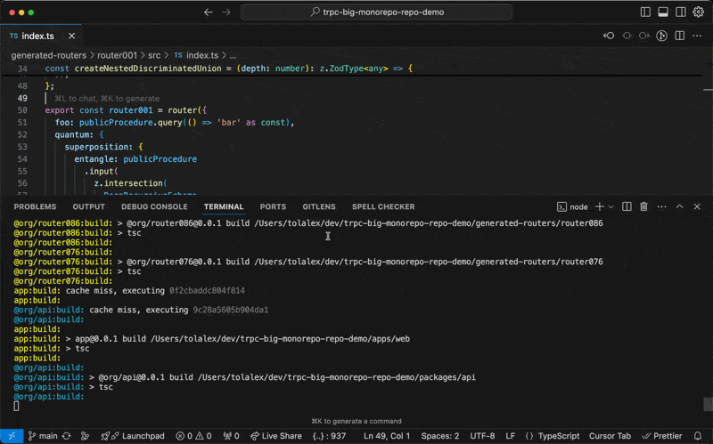

# tRPC big monorepo Demo

Showcases a monorepo with 50 complex routers that uses tRPC by splitting them up into sub-packages, making rebuilds and LSP performance fast.



## Notes

- Takes a while to build as it builds 50+ packages in parallel
- Subsequent builds are when you change packages are fast (<1s on my machine)
- Watching for changes is fast after initial build
- Uses an _(hopefully)_ upcoming version of TypeScript (uses [this PR](https://github.com/microsoft/TypeScript/pull/60005) that fixes go to definition)
- Uses codegen to create bespoke clients for each router in order to fix go to definition as go to definition doesn't work [doesn't work through sub-packages](https://github.com/microsoft/TypeScript/issues/61001)

## Setup

```shell
git clone git@github.com:KATT/trpc-big-monorepo-repo-demo.git
cd trpc-big-monorepo-repo-demo
pnpm i
pnpm build
```

## Run watch

```shell
pnpm run dev
```

Try changing the return type of `router0001`'s `foo` [here](./generated-routers/router001/src/index.ts#L58) to while watching to see how fast rebuilds are and how fast errors propagate
